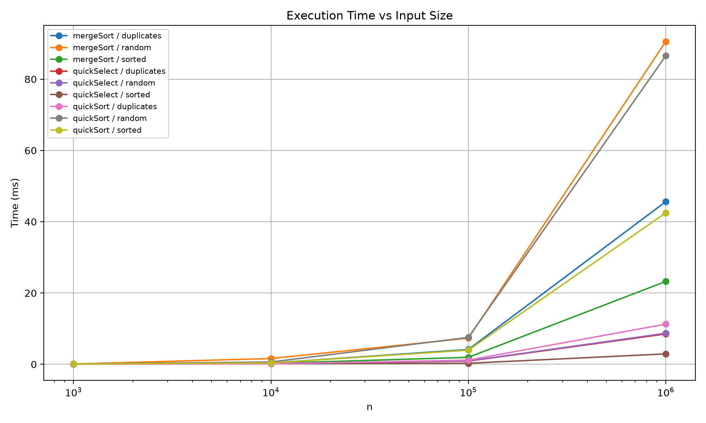
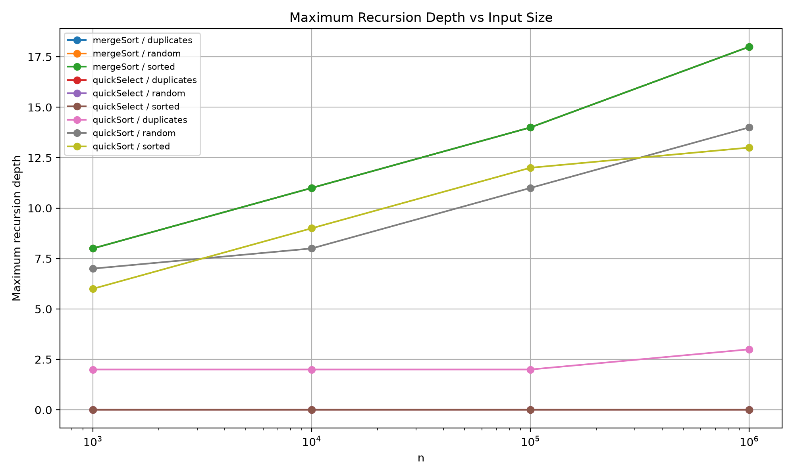
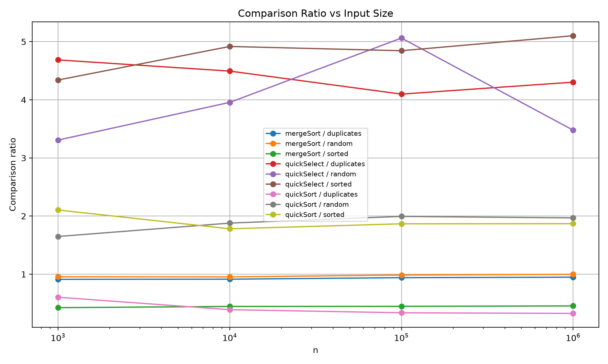

# Assignment 1 Report
## Divide and Conquer

## 1. Asymptotic Bounds

| Algorithm | Best | Average | Worst |
|---|---|---|---|
| MergeSort | Θ(n log n) | Θ(n log n) | Θ(n log n) |
| QuickSort | Θ(n log n) | Θ(n log n) expected | Θ(n²) |
| QuickSelect | Θ(n) | Θ(n) expected | Θ(n²) |
| Insertion Sort | Θ(n) | Θ(n²) | Θ(n²) |

MergeSort always splits the array into two parts, so input order does not change its asymptotic complexity.

QuickSort is fast when pivots split the array well. Random pivot makes good splits likely on average, but very bad pivots can still give Θ(n²).

QuickSelect only continues in the side where k is located, so its average complexity is linear.

Insertion Sort is fast on already sorted arrays, but on reverse/random arrays it may do many shifts.

## 2. Recurrences

### MergeSort

MergeSort splits the array into two halves and merging takes linear time.

T(n) = 2T(n/2) + Θ(n)

- a = 2
- b = 2
- f(n) = Θ(n)
- n^(log_b(a)) = n

This is Master Theorem Case 2.

So:

T(n) = Θ(n log n)

The cutoff of 15 elements only improves small subarrays and does not change the final complexity.

### QuickSort

For balanced partitions:

T(n) = 2T(n/2) + Θ(n)

- a = 2
- b = 2
- f(n) = Θ(n)

This is also Case 2.

T(n) = Θ(n log n)

My QuickSort chooses the pivot randomly. Because of this, sorted input does not automatically create the worst case. On average random pivots give good enough partitions, so expected complexity is Θ(n log n).

I also recurse only into the smaller side and process the bigger side using a while loop. This keeps recursion depth small.

### QuickSelect

For a balanced partition:

T(n) = T(n/2) + Θ(n)

- a = 1
- b = 2
- f(n) = Θ(n)
- n^(log_b(a)) = 1

This is Master Theorem Case 3.

So:

T(n) = Θ(n)

Unlike QuickSort, QuickSelect continues only in one partition.

## 3. Benchmark

I tested:

- n = 1,000
- n = 10,000
- n = 100,000
- n = 1,000,000

Input types:

- random
- sorted
- duplicates (values from 0 to 9)

Every case was executed 5 times and median time was saved.

## 4. Results

### Time

For random input with n = 1,000,000:

| Algorithm | Time |
|---|---:|
| MergeSort | 90.560 ms |
| QuickSort | 86.558 ms |
| QuickSelect | 8.719 ms |

QuickSelect is much faster because it does not sort the whole array.

QuickSort with duplicates was especially fast. For 1,000,000 elements it took only 11.273 ms. The 3-way partition works well here because equal elements are handled together.

MergeSort was faster on sorted input. At n = 1,000,000 it took 23.249 ms compared to 90.560 ms for random input.

### Recursion Depth

MergeSort depth:

| n | depth |
|---:|---:|
| 1,000 | 8 |
| 10,000 | 11 |
| 100,000 | 14 |
| 1,000,000 | 18 |

QuickSort:

| n | random | sorted | duplicates |
|---:|---:|---:|---:|
| 1,000 | 7 | 6 | 2 |
| 10,000 | 8 | 9 | 2 |
| 100,000 | 11 | 12 | 2 |
| 1,000,000 | 14 | 13 | 3 |

QuickSort depth stays small even for one million elements. This happens because only the smaller partition uses recursion.

QuickSelect has depth 0 because my implementation uses a loop instead of recursion.

## 5. Ratio and Theta Check

For MergeSort and QuickSort I used:

ratio = comparisons / (n * log2(n))

For QuickSelect:

ratio = comparisons / n

### MergeSort

Random input:

| n | ratio |
|---:|---:|
| 1,000 | 0.956 |
| 10,000 | 0.954 |
| 100,000 | 0.987 |
| 1,000,000 | 0.998 |

The ratio is almost constant.

Rough values:

- c1 ≈ 0.95
- c2 ≈ 1.00
- n0 ≈ 1,000

This matches Θ(n log n).

### QuickSort

Random input:

| n | ratio |
|---:|---:|
| 1,000 | 1.649 |
| 10,000 | 1.880 |
| 100,000 | 1.995 |
| 1,000,000 | 1.969 |

The ratio becomes roughly stable around 2 for bigger arrays.

Rough values:

- c1 ≈ 1.6
- c2 ≈ 2.0
- n0 ≈ 1,000

This agrees with expected Θ(n log n) behavior.

### QuickSelect

Random input:

| n | comparisons / n |
|---:|---:|
| 1,000 | 3.308 |
| 10,000 | 3.956 |
| 100,000 | 5.063 |
| 1,000,000 | 3.478 |

QuickSelect has more variation because random pivot can make different partitions each run. Still, the ratio stays in the same general range instead of continuously growing with n.

For these measurements rough values are:

- c1 ≈ 3.3
- c2 ≈ 5.1
- n0 ≈ 1,000

The experiment is consistent with expected linear average complexity.

## 6. Discussion

The results mostly match the theory. MergeSort has very stable n log n comparison growth. QuickSort also behaves close to n log n on random and sorted arrays. Random pivot helps QuickSort avoid bad behavior on already sorted input. The duplicates input is much faster because 3-way partition can remove many equal values at once. QuickSelect is faster because it only searches one side instead of sorting everything. Its comparison ratio changes more because the pivot is random. JVM warm-up can affect the first runs, which is why I used median of 5 runs. Garbage Collector and CPU cache can also change measured time. The cutoff of 15 in MergeSort also helps reduce overhead for small subarrays.